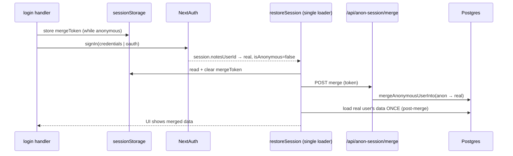

# Anonymous Account Architecture

## Why this plan exists

Anonymous visitors are backed by a real `user_v1` row (`is_anonymous = true`) with
real notes/categories/tags. Turning that visitor into a permanent account currently
loses their work on sign-in. The proximate cause is a client-side race, but the
deeper issue is structural: **the client has several independent effects that each
react to auth/session state and each load data**, so any change to login logic or
schema tends to reintroduce a race. This plan removes that class of bug in two
phases.

Everything here is about the account/load architecture. The surrounding, orthogonal
improvements (persisting the outgoing draft before sign-in, merge-failure messaging,
embedding backfill, tests) live in `anonymous_merge_sync_fix_8f2c1a90.plan.md` and
should ship alongside Phase 1.

### Key files

| Layer | File |
|-------|------|
| UI / load orchestration | `apps/notes-next/src/components/notes/NotesApp.tsx` |
| Session provider | `apps/notes-next/app/providers.tsx` |
| Auth (providers, JWT/session callbacks) | `apps/notes-next/src/auth.ts` |
| Merge token (HMAC) | `apps/notes-next/src/lib/anonymousMergeToken.ts` |
| Merge / anon SQL | `lib/db-marketing/sql/user/anonymous.ts` |
| Credential lookup | `lib/db-marketing/sql/user/gets.ts` |
| Service layer | `lib/db-marketing/services/notes-app.ts` |
| Merge routes | `apps/notes-next/app/api/anon-session/merge-token/route.ts`, `.../merge/route.ts` |
| Local cache | `apps/notes-next/src/lib/notesCache.ts` |

---

# Phase 1 — One deterministic post-login load path

**Goal:** exactly one piece of code loads session data after login, and the merge is
part of that one path. With a single writer, the race cannot happen regardless of
which login method triggered it.

## The race today

`restoreSession` is an effect keyed on the auth user id:

```880:894:apps/notes-next/src/components/notes/NotesApp.tsx
    void restoreSession()
    return () => {
      active = false
    }
  }, [
    authSession?.user?.notesUserId,
    authStatus,
    // ...
  ])
```

`SessionProvider` (`app/providers.tsx`) refetches the session immediately after
`signIn`, so `authSession.user.notesUserId` flips to the real user and
`restoreSession` re-fires — loading the real account's **pre-merge** data and writing
both React state and the local cache. Meanwhile `handleLogin` runs its own
merge+reload:

```1482:1509:apps/notes-next/src/components/notes/NotesApp.tsx
      if (mergeToken) {
        try {
          const mergeResponse = await fetch("/api/anon-session/merge", { /* ... */ })
          if (mergeResponse.ok) {
            // applyLoadedUser + loadCategories/loadTags/loadNotes + writeNotesCache
          }
        } catch {
          // Merge failure is non-fatal — anonymous data stays for cleanup
        }
      }
```

And OAuth has a third writer that merges but never reloads:

```2175:2191:apps/notes-next/src/components/notes/NotesApp.tsx
  useEffect(() => {
    // ... reads sessionStorage "notes-merge-token"
    void fetch("/api/anon-session/merge", { /* ... */ }).catch(() => {})
  }, [authStatus, authSession?.user?.notesUserId, authSession?.user?.isAnonymous])
```

Three writers to the same state, ordered non-deterministically. The stale
`restoreSession` fetch (started pre-merge) can resolve last and overwrite the merged
view. The local cache re-persists the stale snapshot, so the loss survives reloads
until a background refresh happens to win.

## Target design



The login handlers stop loading data. `restoreSession` becomes the only loader and
performs the merge inline before its single load, so what it loads is always
post-merge.

## Steps

### 1. Unify merge-token capture

Use one `sessionStorage` key (e.g. `notes-pending-merge-token`) for both paths,
captured while the session is still anonymous.

- `handleLogin`: (first, persist the outgoing draft — see the improvements plan) →
  `POST /api/anon-session/merge-token` → store token in `sessionStorage` →
  `signIn("credentials", { redirect: false })`. **Remove** the inline merge+reload
  block (`:1482`–`:1509`).
- `handleSocialSignIn`: same capture into the same key, then
  `signIn(provider, { callbackUrl: "/" })` (unchanged redirect). This already uses
  `sessionStorage`; just standardize the key.

### 2. Make `restoreSession` the single, merge-aware loader

Inside `restoreSession`, after confirming an authenticated **non-anonymous** session
(`authStatus === "authenticated" && authSession.user.notesUserId && !isAnonymous`):

1. Read the pending merge token from `sessionStorage`.
2. If present:
   - **Skip the stale cache-first paint** for this login (do not early-return on
     `cachedSnapshot`) so pre-merge data is never shown.
   - `await fetch("/api/anon-session/merge", { body: { mergeToken } })`.
   - Remove the token from `sessionStorage`.
   - On success: fall through to the existing
     `fetchFreshSession(storedUserId, { applyUser: true })`, which now returns
     post-merge data and rewrites the cache. Optionally seed `applyLoadedUser` from
     the merge response to avoid any flash.
   - On failure: still load the real account (so the user isn't stuck) and surface a
     recoverable warning (merge-failure UX in the improvements plan). Do **not** sign
     the user out.
3. If absent: existing behavior (cache-first paint + background refresh) unchanged.

### 3. Remove the other writers

- Delete the merge+reload block in `handleLogin` (now owned by `restoreSession`).
- Delete the standalone OAuth merge effect (`:2175`).

After this, credentials and OAuth are the same flow: stash token → `signIn` →
`restoreSession` merges then loads once.

### 4. Idempotency

Primary guard is removing the token from `sessionStorage` before the merge fetch
resolves. Add a belt-and-suspenders `mergeInFlightRef` so a re-render mid-merge can't
launch a second call. The merge route + SQL are already safe to call repeatedly
(`ON CONFLICT DO NOTHING`, anon-row existence checks), so a duplicate is harmless but
should still be avoided.

## Phase 1 verification

1. **Credentials, existing account** — anon create note + category, wait for
   autosave, sign in → merged data appears immediately; anon `user_v1` deleted.
2. **OAuth** — same, merged data appears with no manual refresh.
3. **Returning account with prior notes** — anon work + existing notes both visible,
   deduped by label.
4. **Race probe** — throttle the network and repeat (1)/(2) several times; merged
   data must win every time.
5. `pnpm --filter notes-next check-types` and `build`.

---

# Phase 2 — Claim in place, and a single server-authoritative merge

**Goal:** stop moving data between two users in the common case, and confine the one
remaining reconciliation to a single server step that is durable across schema
changes. This makes the "keep my work" flow correct by construction — there is
nothing to race because nothing changes owner.

## Insight

Turning a visitor into an account has two distinct cases. **Both are expected,
first-class workflows** — the entire premise of the app is "write first, sign in /
organize later," so a visitor arriving with real work is the norm, not an edge case.
Neither case may ever lose data:

- **New account (signup):** there is no second user. We don't need to move
  anything — we upgrade the anonymous row in place.
- **Sign back into a pre-existing account:** two rows genuinely exist and must be
  reconciled (dedup categories/tags by label). This is a fully-supported, everyday
  path (a returning user who jotted more notes while signed out), not a rarity. Keep
  a merge, but make it server-authoritative, schema-durable, **and retryable so a
  transient failure can never strand the visitor's work.**

Phase 2 introduces a **signup** flow (which the app does not have today — the login
form only authenticates against existing accounts) to unlock the signup case, and
hardens the merge so the sign-back-in case is equally lossless.

### Two facts about today's code that shape Phase 2

1. **Passwords are stored and compared in plaintext.** `verifyUserCredentials`
   (`lib/db-marketing/sql/user/gets.ts`) does `row.password !== password`; there is
   no hashing helper, and **no code path currently writes a password** (the
   `password` column exists but is only ever set out-of-band). `claimAnonymousUser`
   will be the first writer, so its write format and the verify format must be
   changed together (see Part A / `p2_password_hash`).
2. **OAuth cannot create an account today.** The `signIn` callback in `auth.ts`
   returns `false` for a social login unless `findUserByIdentifier(email)` already
   finds a **non-anonymous** account. An anonymous visitor who clicks one of the
   four social buttons for the first time is rejected. Signup-via-OAuth therefore
   needs an explicit claim-in-place path (see Part A / `p2_oauth_signup`).

## Part A — Claim the anonymous user in place (signup)

No data moves; `user_id` is stable end to end; there is no cross-user load, so no
race is even possible.

### A0. Password helper (prerequisite for A1)

Today `verifyUserCredentials` compares plaintext (`row.password !== password`) and
nothing in the codebase writes a password. Because `claimAnonymousUser` is the first
writer, introduce **one** shared helper module (e.g.
`lib/db-marketing/sql/user/password.ts`) with `hashPassword(plain)` and
`verifyPassword(plain, stored)` and use it in **both** places in the same change:

- `claimAnonymousUser` hashes on write.
- `verifyUserCredentials` switches from `!==` to `verifyPassword(...)`.

Since no plaintext passwords are produced by code today, there is no legacy data to
migrate; this is a safe moment to add hashing (prefer `scrypt`/`bcrypt` from a
vetted dep, or Node's built-in `crypto.scrypt` to avoid a new dependency). No schema
change is needed — the `password text` column already stores the encoded hash. If
the team prefers to defer hashing, the fallback is to write plaintext to match the
current verify — but do **not** write a hash while verify still compares plaintext,
or every claimed account will be locked out on next sign-in.

### A1. DB helper

Add `claimAnonymousUser` in `lib/db-marketing/sql/user/anonymous.ts`
(or a sibling `claim.ts`), in one transaction:

```
claimAnonymousUser(anonUserId, { username, email?, phone?, password }): Promise<UserSummary>
  1. SELECT is_anonymous FROM user_v1 WHERE id = anonUserId FOR UPDATE
     → throw if row missing or not anonymous.
  2. Enforce identity uniqueness against non-anonymous rows, checking EACH provided
     field independently with the same normalization gets.ts uses
     (lower(username), lower(email), phone digits via
     regexp_replace(...,'\D','','g')) AND is_anonymous = false, excluding this row.
     On collision, throw a typed/identifiable error so the API can return a 409 and
     the UI can redirect the user to the returning-account sign-in path.
  3. UPDATE user_v1 SET username=$, email=$, phone=$, password=hashPassword($),
     is_anonymous=false WHERE id = anonUserId.
  4. RETURN the updated UserSummary.
```

The written password format MUST match what `verifyUserCredentials` compares against
(see A0) so the new credentials verify on the next sign-in.

### A2. Service + API

- Service wrapper `claimAnonymousNotesAppSession({ anonUserId, ...identity })` in
  `lib/db-marketing/services/notes-app.ts`, added to `notesAppService`.
- `POST /api/anon-session/claim`: `auth()` must be the anonymous session
  (`session.user.isAnonymous === true`); call the service with
  `anonUserId = session.user.notesUserId`; return the updated user. Map the A1
  identity-collision error to **409** so the client can switch to the
  returning-account sign-in (which then runs the Part B merge into the existing
  account) instead of silently failing.
- The claim response reuses the existing `SessionResponse`/`UserSummary` shape, so
  no Notes contract change or migration is required. If any contract/schema does
  change, follow the DB discipline in the Phase 2 verification checklist.

### A3. Client flow (race-free by construction)

1. Anonymous user opens the header popup and chooses **Create account**; the popup
   toggles between "Sign in" (existing) and "Create account" (new). Fills
   username/email/password (extend `NotesHeader.tsx`; keep `LoginForm.tsx` in sync
   if the full-page login also gains signup).
2. (Persist outgoing draft — improvements plan.) `POST /api/anon-session/claim`.
3. On success, `signIn("credentials", { identifier, password, redirect: false })`
   for the **same** `user_id`. This re-mints the JWT with `isAnonymous = false`
   (see `jwt` callback in `auth.ts`, which sets `isAnonymous` at sign-in time).
4. `restoreSession` sees the **same** `notesUserId` → it just refreshes the same
   account's data. No merge, no token, no cross-user load, no race.
5. On **409 identity conflict** (the chosen username/email/phone already belongs to
   a real account): surface a clear message and route the user into the normal
   sign-in flow for that account. That flow already captures a merge token while
   anonymous (Phase 1), so their current visitor work is reconciled into the
   existing account via Part B — no data is lost by picking an in-use identity.

Note on the JWT: `isAnonymous` is only set when `user` is present (initial sign-in),
so re-signing in is the clean way to flip it. Alternatively extend the `jwt` callback
to re-read `is_anonymous` from the DB on `trigger === "update"` and drive it via
`useSession().update()`; the re-signIn approach is simpler and reuses existing code.

### A4. Guarding credential lookup

`findUserByIdentifier`/`verifyUserCredentials` already filter `is_anonymous = false`,
so an anonymous placeholder username can never satisfy a login. After claim the row
is non-anonymous and behaves like any account. Confirm the uniqueness check in A1
uses the same normalization (phone digit-stripping, case-insensitive email/username).

### A5. Signup via OAuth (first-time social visitor)

The header popup shows four social buttons to anonymous users, but today a social
login **cannot create an account**: `auth.ts`'s `signIn` callback returns `false`
unless `resolveNotesUserId(email)` already finds a non-anonymous account. So a
first-time visitor who clicks "Continue with Google" is rejected — which directly
contradicts the "sign in later" product promise. Phase 2 must make OAuth a real
signup path, using the same claim-in-place principle (no data movement):

- **Carry the anonymous `user_id` across the OAuth round-trip.** The redirect leaves
  the page, so stash it the same way the merge token is stashed: when
  `handleSocialSignIn` runs for an anonymous session, write a short-lived, signed
  claim intent (reuse `anonymousMergeToken.ts`'s HMAC signing, or set a dedicated
  httpOnly cookie server-side) alongside the existing merge-token capture.
- **In the `signIn`/`jwt` callbacks, branch on "is there a pending anon claim?":**
  - **Email matches an existing non-anonymous account** → this is the
    *returning-account* case: allow sign-in to that account and let Part B merge the
    anon work in (unchanged from Phase 1). Do **not** claim.
  - **Email matches no account** → this is *signup*: claim the anon row in place —
    set `email` (and `username` from the profile), flip `is_anonymous = false`, and
    resolve `notesUserId` to the **same** anon `user_id`. No second row, no merge.
- Enforce the same per-field uniqueness as A1 (guard against two anon sessions
  claiming the same email). If the email is taken by a real account, fall through to
  the returning-account merge rather than erroring.
- **Security:** only honor the pending-claim intent when the caller genuinely owns
  the anon session (verify the signed token / httpOnly cookie server-side); never
  trust a client-supplied anon id.

This keeps one mental model: an anonymous→real transition either **claims in place**
(no matching account) or **merges** (matching account), regardless of whether the
method is credentials or OAuth.

## Part B — Existing-account login: one server-authoritative, schema-durable, lossless merge

For the **expected, first-class** case (an anonymous visitor signs back into an
account that already exists — e.g. a returning user who jotted more notes while
signed out), keep a merge, but harden it so it is durable, schema-proof, and
**never loses the visitor's work**:

### B1. Server-authoritative

Phase 1 already makes `restoreSession` the single client trigger. Keep the merge
behind the existing `POST /api/anon-session/merge` + signed token (proves the browser
owned the anon session). The client never reconciles data; it only asks the server to
merge and then loads the result. Any future login method inherits this because the
merge is attached to the anonymous→real transition, not to a specific button handler.

### B2. Schema-durable reassignment

Today `mergeAnonymousUserInto` hard-codes each table (categories, tags, notes, tag
links). As the schema grows, every new user-owned table is a place to forget. Make
ownership reassignment data-driven:

- Maintain a single registry of user-owned tables and their `user_id` column
  (either a hand-maintained list in one module, or discovered via
  `information_schema` foreign keys to `user_v1`).
- **Generic reparent:** for tables with no natural-key collisions, one
  `UPDATE <table> SET user_id = $real WHERE user_id = $anon` per registered table.
- **Label dedup where required:** categories and tags keep the current
  `ON CONFLICT (user_id, label) DO NOTHING` + remap logic, since they have a unique
  `(user_id, label)` and can collide with the real account. Notes/tag-links follow
  the remap. Adding a new plain user-owned table then means adding one registry entry
  rather than editing merge SQL.
- Keep the whole thing in one transaction with `FOR UPDATE` on the real user (as
  today) so concurrent merges into the same account serialize.

### B3. Lossless & retryable (no stranded data, ever)

Phase 1 currently clears the pending merge token *before* awaiting the merge fetch
(for idempotency). The side effect: if that single merge attempt fails (network
blip, cold DB, deploy), the token is already gone, the session is now the real user,
and the visitor's anon rows are stranded with no automatic recovery — a data-loss
outcome the product cannot accept. Harden this:

- **Do not treat one failed attempt as terminal.** Keep the pending-merge marker
  until the server confirms success (HTTP 2xx). Prefer clearing it only in the
  success branch; keep the `mergeInFlightRef` guard to prevent concurrent duplicate
  calls within a single load. The merge SQL is already idempotent
  (`ON CONFLICT DO NOTHING`, anon-existence checks), so a retried attempt is safe.
- **Retry on the next `restoreSession`.** If a marker survives (previous attempt
  failed), the next authenticated load re-attempts the merge before loading. Because
  the merge is keyed on the signed token (which encodes the anon `user_id`), it does
  not depend on still holding an anon session.
- **Optional stronger durability:** if the token's short TTL is a concern, record a
  server-side "pending reparent (anonUserId → realUserId)" row so a background job /
  next login can complete it even after the client token expires. This makes the
  guarantee independent of client storage entirely.
- **Only surface "signed in" as fully done once the merge succeeds**; while a retry
  is pending, keep the recoverable warning (improvements plan) rather than implying
  the work is lost.

### B4. Cleanup implications

Because signup now claims in place, far fewer orphaned anon rows are created.
`scripts/cleanup-anonymous-users.mjs` still handles genuinely abandoned sessions and
any anon row left behind by a merge that ultimately failed — but with B3, a merge
that failed transiently should have already been retried and completed, so cleanup
should rarely be deleting rows that still hold un-merged user work. The cleanup
script must not delete an anon row that still has a live pending-reparent marker.

## Phase 2 verification

Run against a real Postgres (as Phase 1 verification required), not just unit fakes —
the merge/claim bugs only surface against real SQL.

1. **Credentials signup (claim-in-place)** — as anon, create notes/categories, choose
   Create account, submit → same notes remain, `user_v1.id` unchanged, `is_anonymous`
   now false. Confirm **zero** rows changed `user_id`. Then **sign out and sign back
   in with the new credentials** to prove the written password verifies (A0 hashing
   round-trips).
2. **OAuth signup (first-time social visitor)** — as anon with notes, click a social
   provider whose email has **no** existing account → account is created by claiming
   the anon row in place (same `user_v1.id`, `is_anonymous` false, zero `user_id`
   changes), notes intact. (Before Phase 2 this login is rejected outright.)
3. **Identity conflict on signup** — as anon, try Create account with a
   username/email already owned by a real account → API returns 409, UI routes to
   sign-in, and completing sign-in merges the anon work into that existing account
   (case 4) with no loss.
4. **Returning-account login (credentials and OAuth)** — anon work + existing account
   reconcile server-side; deduped by label; anon row deleted; both the pre-existing
   notes and the new anon notes are present.
5. **Lossless merge under failure (B3)** — force the first `/api/anon-session/merge`
   to fail (e.g. throttle/kill the request or return 500 once), confirm the visitor
   data is **not** lost: the pending marker survives and the next `restoreSession`
   retries and completes the merge; final state has all data on the real account.
6. **Schema-durability probe** — add a throwaway user-owned table, register it, run a
   returning-account merge, confirm its rows reparent without editing merge SQL.
   (Confirm tables without a `user_id` column, like `user_note_tag_link_v1`, are
   handled via the remap path, not the generic reparent registry.)
7. `pnpm --filter notes-next check-types`, `build`, `test`.
8. DB migration/verify discipline if any schema/contract changes are introduced
   (`db:migrate`, update `scripts/verify-contract.mjs`, `db:verify`, commit generated
   artifacts) per `lib/db-marketing/AGENTS.md`. Note: claim/OAuth-claim reuse the
   existing `password` column and `UserSummary` shape, so no migration is expected —
   but if you add a pending-reparent table (B3 optional) or change the contract, run
   the full discipline.

## Sequencing

Phase 1 is a self-contained fix for the reported bug and a prerequisite for Phase 2
(both require the client to have exactly one loader). Ship Phase 1 + the improvements
plan first, verify in production, then build Phase 2 (signup + claim-in-place +
durable server merge).
