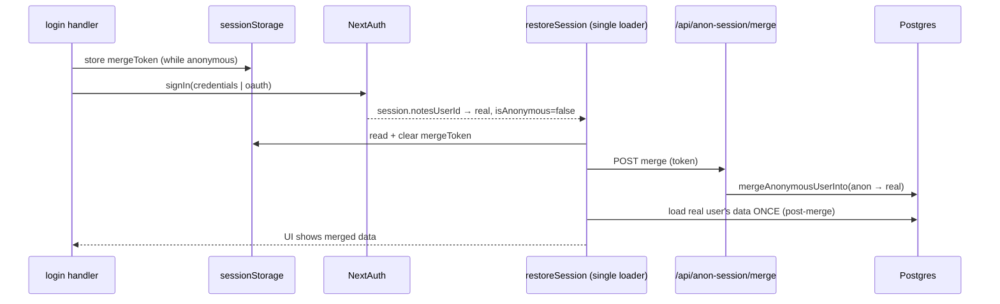

# Anonymous Account Architecture

## Why this plan exists

Anonymous visitors are backed by a real `user_v1` row (`is_anonymous = true`) with
real notes/categories/tags. Turning that visitor into a permanent account currently
loses their work on sign-in. The proximate cause is a client-side race, but the
deeper issue is structural: **the client has several independent effects that each
react to auth/session state and each load data**, so any change to login logic or
schema tends to reintroduce a race. This plan removes that class of bug in two
phases.

Everything here is about the account/load architecture. The surrounding, orthogonal
improvements (persisting the outgoing draft before sign-in, merge-failure messaging,
embedding backfill, tests) live in `anonymous_merge_sync_fix_8f2c1a90.plan.md` and
should ship alongside Phase 1.

### Key files

| Layer                                   | File                                                                              |
| --------------------------------------- | --------------------------------------------------------------------------------- |
| UI / load orchestration                 | `apps/notes-next/src/components/notes/NotesApp.tsx`                               |
| Session provider                        | `apps/notes-next/app/providers.tsx`                                               |
| Auth (providers, JWT/session callbacks) | `apps/notes-next/src/auth.ts`                                                     |
| Merge token (HMAC)                      | `apps/notes-next/src/lib/anonymousMergeToken.ts`                                  |
| Merge / anon SQL                        | `lib/db-marketing/sql/user/anonymous.ts`                                          |
| Credential lookup                       | `lib/db-marketing/sql/user/gets.ts`                                               |
| Service layer                           | `lib/db-marketing/services/notes-app.ts`                                          |
| Merge routes                            | `apps/notes-next/app/api/anon-session/merge-token/route.ts`, `.../merge/route.ts` |
| Local cache                             | `apps/notes-next/src/lib/notesCache.ts`                                           |

---

# Phase 1 — One deterministic post-login load path

**Goal:** exactly one piece of code loads session data after login, and the merge is
part of that one path. With a single writer, the race cannot happen regardless of
which login method triggered it.

## The race today

`restoreSession` is an effect keyed on the auth user id:

```880:894:apps/notes-next/src/components/notes/NotesApp.tsx
    void restoreSession()
    return () => {
      active = false
    }
  }, [
    authSession?.user?.notesUserId,
    authStatus,
    // ...
  ])
```

`SessionProvider` (`app/providers.tsx`) refetches the session immediately after
`signIn`, so `authSession.user.notesUserId` flips to the real user and
`restoreSession` re-fires — loading the real account's **pre-merge** data and writing
both React state and the local cache. Meanwhile `handleLogin` runs its own
merge+reload:

```1482:1509:apps/notes-next/src/components/notes/NotesApp.tsx
      if (mergeToken) {
        try {
          const mergeResponse = await fetch("/api/anon-session/merge", { /* ... */ })
          if (mergeResponse.ok) {
            // applyLoadedUser + loadCategories/loadTags/loadNotes + writeNotesCache
          }
        } catch {
          // Merge failure is non-fatal — anonymous data stays for cleanup
        }
      }
```

And OAuth has a third writer that merges but never reloads:

```2175:2191:apps/notes-next/src/components/notes/NotesApp.tsx
  useEffect(() => {
    // ... reads sessionStorage "notes-merge-token"
    void fetch("/api/anon-session/merge", { /* ... */ }).catch(() => {})
  }, [authStatus, authSession?.user?.notesUserId, authSession?.user?.isAnonymous])
```

Three writers to the same state, ordered non-deterministically. The stale
`restoreSession` fetch (started pre-merge) can resolve last and overwrite the merged
view. The local cache re-persists the stale snapshot, so the loss survives reloads
until a background refresh happens to win.

## Target design



The login handlers stop loading data. `restoreSession` becomes the only loader and
performs the merge inline before its single load, so what it loads is always
post-merge.

## Steps

### 1. Unify merge-token capture

Use one `sessionStorage` key (e.g. `notes-pending-merge-token`) for both paths,
captured while the session is still anonymous.

- `handleLogin`: (first, persist the outgoing draft — see the improvements plan) →
  `POST /api/anon-session/merge-token` → store token in `sessionStorage` →
  `signIn("credentials", { redirect: false })`. **Remove** the inline merge+reload
  block (`:1482`–`:1509`).
- `handleSocialSignIn`: same capture into the same key, then
  `signIn(provider, { callbackUrl: "/" })` (unchanged redirect). This already uses
  `sessionStorage`; just standardize the key.

### 2. Make `restoreSession` the single, merge-aware loader

Inside `restoreSession`, after confirming an authenticated **non-anonymous** session
(`authStatus === "authenticated" && authSession.user.notesUserId && !isAnonymous`):

1. Read the pending merge token from `sessionStorage`.
2. If present:

- **Skip the stale cache-first paint** for this login (do not early-return on
  `cachedSnapshot`) so pre-merge data is never shown.
- `await fetch("/api/anon-session/merge", { body: { mergeToken } })`.
- Remove the token from `sessionStorage`.
- On success: fall through to the existing
  `fetchFreshSession(storedUserId, { applyUser: true })`, which now returns
  post-merge data and rewrites the cache. Optionally seed `applyLoadedUser` from
  the merge response to avoid any flash.
- On failure: still load the real account (so the user isn't stuck) and surface a
  recoverable warning (merge-failure UX in the improvements plan). Do **not** sign
  the user out.

1. If absent: existing behavior (cache-first paint + background refresh) unchanged.

### 3. Remove the other writers

- Delete the merge+reload block in `handleLogin` (now owned by `restoreSession`).
- Delete the standalone OAuth merge effect (`:2175`).

After this, credentials and OAuth are the same flow: stash token → `signIn` →
`restoreSession` merges then loads once.

### 4. Idempotency

Primary guard is removing the token from `sessionStorage` before the merge fetch
resolves. Add a belt-and-suspenders `mergeInFlightRef` so a re-render mid-merge can't
launch a second call. The merge route + SQL are already safe to call repeatedly
(`ON CONFLICT DO NOTHING`, anon-row existence checks), so a duplicate is harmless but
should still be avoided.

## Phase 1 verification

1. **Credentials, existing account** — anon create note + category, wait for
   autosave, sign in → merged data appears immediately; anon `user_v1` deleted.
2. **OAuth** — same, merged data appears with no manual refresh.
3. **Returning account with prior notes** — anon work + existing notes both visible,
   deduped by label.
4. **Race probe** — throttle the network and repeat (1)/(2) several times; merged
   data must win every time.
5. `pnpm --filter notes-next check-types` and `build`.

---

# Phase 2 — Claim in place, and a single server-authoritative merge

**Goal:** stop moving data between two users in the common case, and confine the one
remaining reconciliation to a single server step that is durable across schema
changes. This makes the "keep my work" flow correct by construction — there is
nothing to race because nothing changes owner.

## Insight

Turning a visitor into an account has two distinct cases:

- **New account (the common path):** there is no second user. We don't need to move
  anything — we upgrade the anonymous row in place.
- **Log into a pre-existing account (the rare path):** two rows genuinely exist and
  must be reconciled (dedup categories/tags by label). Keep a merge, but make it
  server-authoritative and schema-durable.

Phase 2 introduces a **signup** flow (which the app does not have today — the login
form only authenticates against existing accounts) to unlock the common path.

## Part A — Claim the anonymous user in place (signup)

No data moves; `user_id` is stable end to end; there is no cross-user load, so no
race is even possible.

### A1. DB helper

Add `claimAnonymousUser` in `lib/db-marketing/sql/user/anonymous.ts`
(or a sibling `claim.ts`), in one transaction:

```
claimAnonymousUser(anonUserId, { username, email?, phone?, password }): Promise<UserSummary>
  1. SELECT is_anonymous FROM user_v1 WHERE id = anonUserId FOR UPDATE
     → throw if not anonymous.
  2. Enforce identity uniqueness against non-anonymous rows (reuse the same
     predicate findUserByIdentifier uses: lower(username)/lower(email)/normalized
     phone AND is_anonymous = false), excluding this row.
  3. UPDATE user_v1 SET username=$, email=$, phone=$, password=<hash>,
     is_anonymous=false WHERE id = anonUserId.
  4. RETURN the updated UserSummary.
```

Password hashing must match `verifyUserCredentials` in
`lib/db-marketing/sql/user/gets.ts` (reuse the same hashing helper so the new
credentials verify on the next sign-in).

### A2. Service + API

- Service wrapper `claimAnonymousNotesAppSession({ anonUserId, ...identity })` in
  `lib/db-marketing/services/notes-app.ts`, added to `notesAppService`.
- `POST /api/anon-session/claim`: `auth()` must be the anonymous session
  (`session.user.isAnonymous === true`); call the service with
  `anonUserId = session.user.notesUserId`; return the updated user.

### A3. Client flow (race-free by construction)

1. Anonymous user opens the header popup and chooses **Create account**; fills
   username/email/password (extend `NotesHeader.tsx` / `LoginForm.tsx`).
2. (Persist outgoing draft — improvements plan.) `POST /api/anon-session/claim`.
3. On success, `signIn("credentials", { identifier, password, redirect: false })`
   for the **same** `user_id`. This re-mints the JWT with `isAnonymous = false`
   (see `jwt` callback in `auth.ts`, which sets `isAnonymous` at sign-in time).
4. `restoreSession` sees the **same** `notesUserId` → it just refreshes the same
   account's data. No merge, no token, no cross-user load, no race.

Note on the JWT: `isAnonymous` is only set when `user` is present (initial sign-in),
so re-signing in is the clean way to flip it. Alternatively extend the `jwt` callback
to re-read `is_anonymous` from the DB on `trigger === "update"` and drive it via
`useSession().update()`; the re-signIn approach is simpler and reuses existing code.

### A4. Guarding credential lookup

`findUserByIdentifier`/`verifyUserCredentials` already filter `is_anonymous = false`,
so an anonymous placeholder username can never satisfy a login. After claim the row
is non-anonymous and behaves like any account. Confirm the uniqueness check in A1
uses the same normalization (phone digit-stripping, case-insensitive email/username).

## Part B — Existing-account login: one server-authoritative, schema-durable merge

When anonymous user authenticates to an account that already exists - keep a merge, but harden it:

### B1. Server-authoritative

Phase 1 already makes `restoreSession` the single client trigger. Keep the merge
behind the existing `POST /api/anon-session/merge` + signed token (proves the browser
owned the anon session). The client never reconciles data; it only asks the server to
merge and then loads the result. Any future login method inherits this because the
merge is attached to the anonymous→real transition, not to a specific button handler.

### B2. Schema-durable reassignment

Today `mergeAnonymousUserInto` hard-codes each table (categories, tags, notes, tag
links). As the schema grows, every new user-owned table is a place to forget. Make
ownership reassignment data-driven:

- Maintain a single registry of user-owned tables and their `user_id` column
  (either a hand-maintained list in one module, or discovered via
  `information_schema` foreign keys to `user_v1`).
- **Generic reparent:** for tables with no natural-key collisions, one
  `UPDATE <table> SET user_id = $real WHERE user_id = $anon` per registered table.
- **Label dedup where required:** categories and tags keep the current
  `ON CONFLICT (user_id, label) DO NOTHING` + remap logic, since they have a unique
  `(user_id, label)` and can collide with the real account. Notes/tag-links follow
  the remap. Adding a new plain user-owned table then means adding one registry entry
  rather than editing merge SQL.
- Keep the whole thing in one transaction with `FOR UPDATE` on the real user (as
  today) so concurrent merges into the same account serialize.

### B3. Cleanup implications

Because the common path now claims in place, far fewer orphaned anon rows are
created. `scripts/cleanup-anonymous-users.mjs` still handles genuinely abandoned
sessions and any anon row left behind by a failed existing-account merge.

## Phase 2 verification

1. **Signup (claim-in-place)** — as anon, create notes/categories, choose Create
   account, submit → same notes remain, `user_v1.id` unchanged, `is_anonymous` now
   false, credentials log in on next visit. Confirm **zero** rows changed `user_id`.
2. **Existing-account login** — anon work + existing account reconcile server-side;
   deduped by label; anon row deleted.
3. **Schema-durability probe** — add a throwaway user-owned table, register it, run an
   existing-account merge, confirm its rows reparent without editing merge SQL.
4. `pnpm --filter notes-next check-types`, `build`, `test`.
5. DB migration/verify discipline if any schema/contract changes are introduced
   (`db:migrate`, update `scripts/verify-contract.mjs`, `db:verify`, commit generated
   artifacts) per `lib/db-marketing/AGENTS.md`.

## Sequencing

Phase 1 is a self-contained fix for the reported bug and a prerequisite for Phase 2
(both require the client to have exactly one loader). Ship Phase 1 + the improvements
plan first, verify in production, then build Phase 2 (signup + claim-in-place +
durable server merge).
