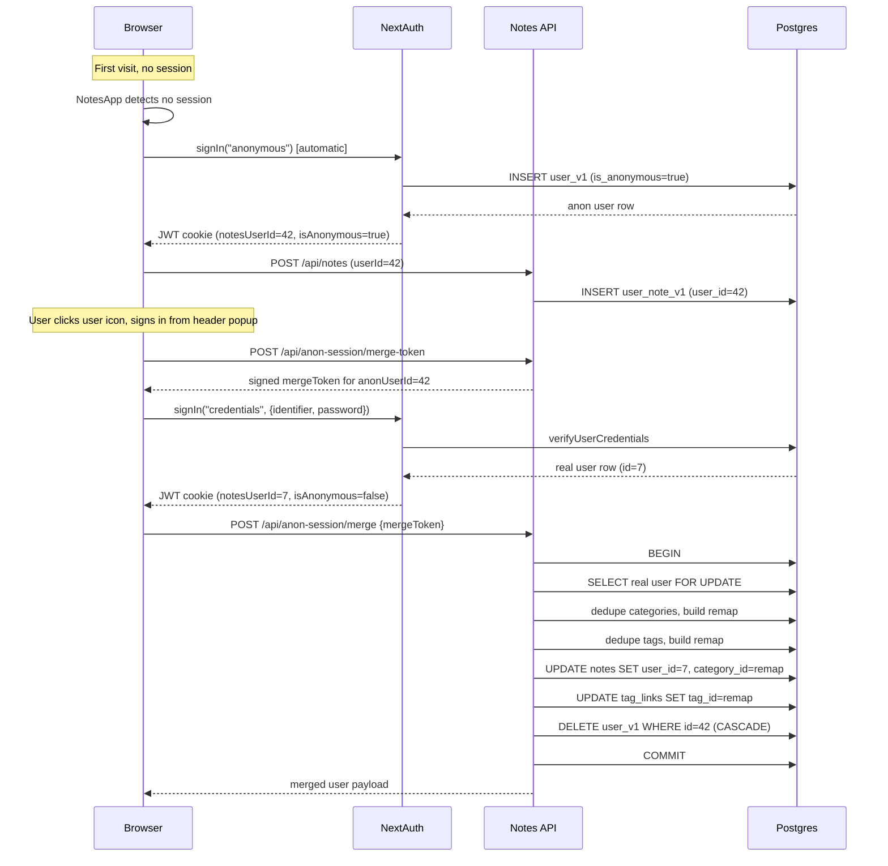

# Anonymous Sessions

When a visitor comes to the web app, they should be able to start editing notes and categories and any other content, just like a signed in user. So, we have to automatically create a temporary anonymous user record in the database.

Anonymous users get a real `user_v1` row marked `is_anonymous`. They use the existing API exactly like a signed-in user. On sign-in, we move their notes/categories/tags to the real account (deduping categories and tags by `(user_id, label)`) and delete the anon user.

To sign in (or sign up, later), the user clicks the **user icon** in [NotesHeader.tsx](apps/notes-next/src/components/notes/NotesHeader.tsx). The popup shows the login form when anonymous, and the usual user info + sign-out when signed in for real.

Note: since every page view by a new visitor creates a DB row, the cleanup script (below) is important for removing stale abandoned anonymous users.

## Schema

Single migration, single new column on [lib/db-marketing/schema/current.sql](lib/db-marketing/schema/current.sql) via a new file `lib/db-marketing/migrations/<ts>__user_anonymous.sql`:

```sql
ALTER TABLE public.user_v1
  ADD COLUMN is_anonymous boolean NOT NULL DEFAULT false;

CREATE INDEX user_v1_is_anonymous_idx
  ON public.user_v1 (is_anonymous)
  WHERE is_anonymous = true;
```

Anonymity for any row in any child table is `JOIN user_v1 ON user_id = user_v1.id`. The partial index makes cleanup queries cheap without taxing signed-in writes.

`username` stays `NOT NULL UNIQUE`; we satisfy it for anons by inserting a generated placeholder like `anon-${crypto.randomUUID()}` from TypeScript. Avoid depending on `gen_random_uuid()` in SQL so this does not require any extra Postgres extension assumptions. Retry once on the extremely unlikely unique collision.

After running the migration, regenerate:

- [lib/db-marketing/schema/current.sql](lib/db-marketing/schema/current.sql)
- [lib/db-marketing/generated/typescript/db-types.ts](lib/db-marketing/generated/typescript/db-types.ts)
- [lib/db-marketing/generated/contracts/db-schema.json](lib/db-marketing/generated/contracts/db-schema.json)

Update [lib/db-marketing/scripts/verify-contract.mjs](lib/db-marketing/scripts/verify-contract.mjs) to assert:

- `user_v1.is_anonymous` exists, type `boolean`, NOT NULL, default `false`.
- Index `user_v1_is_anonymous_idx` exists and is partial (`WHERE is_anonymous = true`).

## SQL helpers

In [lib/db-marketing/sql/user/gets.ts](lib/db-marketing/sql/user/gets.ts) (or a new sibling `lib/db-marketing/sql/user/anonymous.ts`):

- `createAnonymousUser()` — `INSERT INTO user_v1 (username, is_anonymous) VALUES ($generatedAnonUsername, true) RETURNING ...`. Returns `UserSummary`.
- Filter anons out of credential lookup: in `findUserByIdentifier`, add `AND is_anonymous = false` so anon usernames can never satisfy a sign-in. `verifyUserCredentials` is already safe (anons have `password = NULL`).

In a new `lib/db-marketing/sql/user/merge.ts`, add `mergeAnonymousUserInto(anonUserId, realUserId)` running in a single transaction:

1. Verify `anonUserId.is_anonymous = true` and `realUserId.is_anonymous = false`. Throw otherwise.
2. **Lock the destination user** to serialize concurrent merges into the same real account (e.g. user signs in on two devices nearly simultaneously):
   ```sql
   SELECT id FROM user_v1 WHERE id = $real FOR UPDATE;
   ```
3. **Categories**: insert anon labels into the real user, dedupe by unique `(user_id, label)`:
   ```sql
   INSERT INTO user_note_category_v1 (user_id, label)
   SELECT $real, label FROM user_note_category_v1 WHERE user_id = $anon
   ON CONFLICT (user_id, label) DO NOTHING;
   ```
   Build the remap by joining anon → real by `label`:
   ```sql
   SELECT a.id AS anon_id, r.id AS real_id
   FROM user_note_category_v1 a
   JOIN user_note_category_v1 r
     ON r.user_id = $real AND r.label = a.label
   WHERE a.user_id = $anon;
   ```
4. **Tags**: same pattern against `user_note_tag_v1`.
5. **Notes**: reassign and remap category in one statement:
   ```sql
   UPDATE user_note_v1 n
   SET user_id = $real,
       category_id = m.real_id
   FROM (<category remap>) m
   WHERE n.user_id = $anon AND n.category_id = m.anon_id;
   ```
6. **Tag links**: remap tag IDs on the (now-real-owned) notes:
   ```sql
   UPDATE user_note_tag_link_v1 l
   SET tag_id = m.real_id
   FROM (<tag remap>) m
   WHERE l.tag_id = m.anon_id;
   ```
   No PK collisions are possible here because each anon note linked only to anon tags, and the remap is 1:1 by label within the anon user.
7. `DELETE FROM user_v1 WHERE id = $anon`. CASCADE cleans up the now-empty anon-owned `user_note_category_v1` and `user_note_tag_v1` rows.

This logic is **safe across multiple sequential merges into the same real account** (e.g. a user signs in on phone, then later on laptop). Each merge only touches rows tagged with its source `anonUserId`, and `ON CONFLICT (user_id, label) DO NOTHING` correctly dedupes against whatever is already there from a previous merge.

### Embedding backfill after merge

The merge SQL bypasses the usual service-layer paths that generate Jina embeddings on category/tag creation, so any _new_ categories or tags inserted into the real user during merge will have `category_embedding` / `tag_embedding = NULL`. After the transaction commits, call the existing embedding maintenance flow (`mode=missing`) for the real user to backfill them. This makes newly-merged categories and tags discoverable by semantic search.

(Notes themselves don't need a backfill — their `description_embedding` was generated when the anon user originally created the note and the description doesn't change during merge.)

Add service wrappers in [lib/db-marketing/services/notes-app.ts](lib/db-marketing/services/notes-app.ts):

- `createAnonymousNotesAppSession(): Promise<SessionResponse>`
- `mergeAnonymousNotesAppSession({ anonUserId, realUserId }): Promise<SessionResponse>` — runs the SQL transaction, then triggers `mode=missing` embedding maintenance for the real user before returning.

## NextAuth: anonymous as a Credentials provider

Reuse the existing JWT session machinery instead of building a parallel anon-auth path. In [apps/notes-next/src/auth.ts](apps/notes-next/src/auth.ts) add a second Credentials provider:

```ts
Credentials({
  id: "anonymous",
  name: "Anonymous",
  credentials: {},
  authorize: async () => {
    const user = await createAnonymousUser()
    return {
      id: String(user.id),
      name: user.username,
      notesUserId: user.id,
      isAnonymous: true,
    }
  },
}),
```

Extend the JWT and session callbacks to carry `isAnonymous`:

- Add `isAnonymous?: boolean` to the `JWT` and `Session.user` type augmentations in [apps/notes-next/src/types/next-auth.d.ts](apps/notes-next/src/types/next-auth.d.ts).
- In the `jwt` callback, set `token.isAnonymous` from `user.isAnonymous` (credentials path) or default to `false` for OAuth/credentials sign-ins.
- In the `session` callback, surface it on `session.user.isAnonymous`.

Existing Notes API routes (`/api/notes`, `/api/categories`, `/api/tags`, search, etc.) do not need behavior changes for anonymous mode because the anonymous session produces a normal `notesUserId`. The only new routes are the merge-token and merge routes below.

## Merge-token security

Never let the browser merge by sending only `{ anonUserId }`. `user_v1.id` is sequential and guessable, so that would let a signed-in user claim another visitor's anonymous data.

Use a short-lived signed merge token instead:

1. While the browser is still authenticated as the anonymous NextAuth session, call `POST /api/anon-session/merge-token`.
2. That route reads `auth()`, requires `session.user.isAnonymous === true`, and signs `{ anonUserId, exp }` with `AUTH_SECRET` using Node `crypto.createHmac("sha256", secret)`.
3. The browser keeps that token only long enough to complete the real sign-in. Use `sessionStorage` for OAuth redirect compatibility; clear it after merge success/failure.
4. After the user is signed in for real, call `POST /api/anon-session/merge` with `{ mergeToken }`.
5. The merge route verifies the HMAC and expiry, extracts `anonUserId`, confirms the DB row is still anonymous, and merges it into `session.user.notesUserId`.

This keeps `is_anonymous` as the only new DB column while still proving the current browser owned the anonymous session before it became a real session.

Implement token signing/verification in one server-only helper, for example [apps/notes-next/src/lib/anonymousMergeToken.ts](apps/notes-next/src/lib/anonymousMergeToken.ts), so both routes use the same payload format and expiry checks. The token should include at least `{ anonUserId, exp }`; optionally include a `purpose: "anonymous-merge"` field so it cannot be confused with another signed blob later.

## API routes

`POST /api/anon-session/merge-token` at [apps/notes-next/app/api/anon-session/merge-token/route.ts](apps/notes-next/app/api/anon-session/merge-token/route.ts):

1. `const session = await auth()`. Require `session.user.notesUserId` and `session.user.isAnonymous === true`.
2. Return `{ mergeToken }`, signed and expiring quickly (10 minutes is enough for credentials login and most OAuth redirects).

`POST /api/anon-session/merge` at [apps/notes-next/app/api/anon-session/merge/route.ts](apps/notes-next/app/api/anon-session/merge/route.ts):

1. `const session = await auth()`. Require `session.user.notesUserId` and `session.user.isAnonymous === false`.
2. Parse body `{ mergeToken: string }`.
3. Verify the HMAC and expiry, then extract `anonUserId`.
4. Call `mergeAnonymousNotesAppSession({ anonUserId, realUserId: session.user.notesUserId })`.
5. Return the updated user payload.

No new endpoint is needed for _creating_ the anon session — `signIn("anonymous")` does that.

## Frontend

### No login form on homepage

The homepage no longer shows a login form. When `NotesApp` detects no NextAuth session (and no anonymous session), it **automatically** calls `signIn("anonymous", { redirect: false })`. This creates the anon user server-side and returns a JWT session. The app then renders the full notes UI immediately.

Remove the conditional rendering of `<LoginForm>` on the main page. The `LoginForm` component will still exist but is used exclusively inside the header popup (see below).

### Login form moves into [NotesHeader.tsx](apps/notes-next/src/components/notes/NotesHeader.tsx)

The `<Popup>` anchored to the user icon button (lines 82-143) becomes context-aware:

- **When `session.user.isAnonymous === true`**: show the login form (username/password fields, social provider buttons). This replaces the current user-info + sign-out content.
- **When `session.user.isAnonymous === false`** (real signed-in user): show the existing content — username, email, phone, debug section, and "Sign out" button.

Concretely:

- `NotesHeader` receives a new prop `isAnonymous: boolean` (derived from `authSession.user.isAnonymous` in `NotesApp`).
- When anonymous, the popup renders a compact version of `LoginForm` (identifier + password fields, sign-in button, social buttons). No "Continue without signing in" button needed since the user is already using the app.
- When the user completes sign-in from the popup, the merge flow fires (see below), the popup closes, and the app reloads data under the real user.

### Merge flow in [NotesApp.tsx](apps/notes-next/src/components/notes/NotesApp.tsx)

- `handleLogin` (credentials sign-in from the header popup): if `authSession.user.isAnonymous` is true, call `POST /api/anon-session/merge-token` and stash the returned token in memory/sessionStorage. After a successful real sign-in, call `POST /api/anon-session/merge` with that token, then re-fetch notes/categories/tags (or invalidate the cache and let the existing session-refresh path reload).
- Same wrapping for `handleSocialSignIn` once social providers are configured. For OAuth, persist the merge token in `sessionStorage` before redirect and check for it after returning to `/`.
- If merge fails after real sign-in (expired token, network error, deleted anon user), keep the real sign-in successful and show a recoverable warning. Do not roll back the login. The abandoned anonymous row remains eligible for the cleanup script.
- [apps/notes-next/src/lib/notesCache.ts](apps/notes-next/src/lib/notesCache.ts) needs no changes — it's keyed by `userId`, so the cache simply re-keys after merge.

## Maintenance

We deliberately do **not** add a `last_active_at` column to `user_v1`. Reasons:

- `user_v1.time_modified` only bumps when the user row itself changes (preferences), not when notes/categories/tags do, so it's not usable for cleanup as-is.
- A new column with child-table triggers would impose write-path overhead on every signed-in mutation, just to speed up a maintenance query that runs weekly at most.
- An application-layer column bump (extra UPDATE per mutation) is brittle and easy to forget on new endpoints.
- The partial index `user_v1_is_anonymous_idx` already narrows the cleanup scan to a tiny subset, and each `NOT EXISTS` lookup hits indexed FK columns — fast at any realistic scale.

If the app ever grows past the point where this matters, we can add the column then with a backfill migration.

New script `lib/db-marketing/scripts/cleanup-anonymous-users.mjs`:

```sql
DELETE FROM public.user_v1 u
WHERE u.is_anonymous = true
  AND u.time_created < now() - interval '30 days'
  AND NOT EXISTS (SELECT 1 FROM public.user_note_v1 n
                  WHERE n.user_id = u.id AND n.time_modified > now() - interval '30 days')
  AND NOT EXISTS (SELECT 1 FROM public.user_note_category_v1 c
                  WHERE c.user_id = u.id AND c.time_modified > now() - interval '30 days')
  AND NOT EXISTS (SELECT 1 FROM public.user_note_tag_v1 t
                  WHERE t.user_id = u.id AND t.time_modified > now() - interval '30 days');
```

CASCADE deletes the child rows. Add a root-level proxy `db:anon:cleanup` in [package.json](package.json). Run manually for now; promote to scheduled job later if needed.

## Verify and ship

- `pnpm run db:migrate` — apply migration locally.
- `pnpm run db:verify` — confirm verify-contract assertions pass.
- `pnpm --filter notes-next build` — typecheck and build.
- Manual test: open app fresh → app automatically creates anonymous session → create notes/categories/tags → click user icon in header → sign in with existing credentials → verify the anonymous data appears under the signed-in account, with category/tag dedupe working correctly.
- Manual multi-device test: create anonymous data in two separate browsers/profiles, sign both into the same real account one after another, and verify both anonymous datasets merge without duplicate categories/tags.
- Security test: call `POST /api/anon-session/merge` with a raw/guessed `anonUserId` or tampered merge token and confirm it fails.

## Out of scope (explicitly deferred)

- Offline editing / write queue (Approach C) — separate future branch.
- Android anonymous mode — web-only this time.
- Sign-up flow for new accounts.
- UX polish on the anon banner / sign-in prompt timing.

## Data flow


