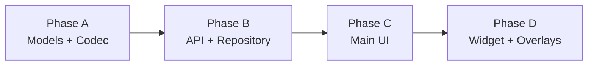

# Android workflow implementation plan

Technical plan for aligning `notes-android` with the unified **notes + tasks** model shipped in Phases 1–3 of the web/backend workflow work (PR #55 and follow-ups).

**Status:** Planning — not yet implemented  
**Contract source of truth:** `lib/db-marketing/contracts/notes-app.ts` and `lib/db-marketing/generated/contracts/notes-app.json`  
**Web reference implementation:** `apps/notes-next` (Phases 1–3 complete)

---

## Table of contents

1. [Product model](#1-product-model)
2. [Goals and non-goals](#2-goals-and-non-goals)
3. [Current Android state](#3-current-android-state)
4. [Architecture decisions](#4-architecture-decisions)
5. [Implementation phases](#5-implementation-phases)
6. [Phase A — Models and JSON codec](#6-phase-a--models-and-json-codec)
7. [Phase B — API client and repository](#7-phase-b--api-client-and-repository)
8. [Phase C — Main app UI](#8-phase-c--main-app-ui)
9. [Phase D — Widget and overlays](#9-phase-d--widget-and-overlays)
10. [File change matrix](#10-file-change-matrix)
11. [Verification and testing](#11-verification-and-testing)
12. [Risks and mitigations](#12-risks-and-mitigations)
13. [AGENTS.md maintenance](#13-agentsmd-maintenance)

---

## 1. Product model

One capture type: text + optional due/remind dates + topic category + tags. Board membership is **not** a separate note type.

| State | `workflow_status_id` | Where it appears |
|-------|----------------------|------------------|
| **Library note** | `NULL` | Notes / library view |
| **Board task** | set to a column id | Board view, grouped by column |

**Topic category** (`category_id`) and **workflow status** (Kanban column) are independent dimensions.

### Server semantics (do not reimplement on Android)

- Default columns are **lazy-seeded** on first `GET /api/workflow-statuses`: backlog → todo → in progress → testing → done.
- Moving a note to a **terminal** column (e.g. done) sets `timeCompleted` server-side.
- Moving out of a terminal column clears `timeCompleted`.
- **Remove from board** sets `workflowStatusId: null`; `timeCompleted` is **kept** (historical record).
- `PATCH /api/notes` with a missing `workflowStatusId` key is treated as `null` — this is the current data-integrity bug on Android.

### Web parity targets

| Web (`notes-next`) | Android equivalent |
|--------------------|--------------------|
| `appView: 'notes' \| 'board'` (Zustand, not persisted) | `AppView.LIBRARY \| BOARD` in `NotesUiState` |
| `isLibraryNote(note)` | `NoteRecord.isLibraryNote()` |
| `getDefaultWorkflowStatusId()` | same helper in `Models.kt` |
| `noteRecordToInput()` | same helper in `Models.kt` |
| `patchNoteWorkflow()` | `NotesRepository.setNoteWorkflowStatus()` |
| Library list filter | `workflowStatus == null` |
| Search | global (library + board) |
| `BoardView` (horizontal Kanban) | **sectioned list** on phone (see §4) |

---

## 2. Goals and non-goals

### Goals

1. **Contract parity** — `pnpm --filter notes-android contracts:check` passes.
2. **Data integrity** — every note POST/PATCH sends explicit `workflowStatusId`; editing a board note never demotes it silently.
3. **Library / board UX** — user can browse library notes, view board tasks, add/remove/move on the board from the main app.
4. **Widget safety** — widget shows library notes; any edit path preserves `workflowStatusId`.
5. **Maintainable structure** — extract UI from the ~1,900-line `MainActivity.kt` during this work.

### Non-goals (v1)

- Backwards compatibility with pre-workflow snapshots (app is unused).
- Kanban column **create**, **delete**, or **reorder** from Android (web Phase 3 only exposes **rename**).
- Board management inside the home-screen widget.
- Persisting `AppView` across app restarts or in `UserPreferences`.
- Reminder cron, time/purchases content types.
- Local Postgres or offline-first sync beyond existing `AppSnapshot` caching.

---

## 3. Current Android state

### Package layout (13 Kotlin source files)

```
app/src/main/java/com/eighthbrain/notesandroid/app/
├── NotesApplication.kt
├── model/Models.kt
├── data/
│   ├── NotesApiClient.kt
│   ├── NotesRepository.kt
│   ├── SessionStore.kt
│   └── JsonCodec.kt
├── ui/
│   ├── MainActivity.kt          # activity + ViewModel + most UI
│   ├── WidgetOverlayActivities.kt
│   ├── CategoriesPopup.kt
│   └── TagsPopup.kt
├── widget/NotesHomeWidget.kt
└── work/
    ├── WidgetRefreshWorker.kt
    └── WidgetRefreshScheduler.kt
```

### Confirmed gaps (as of workflow Phases 1–3 on web)

| Area | Issue |
|------|-------|
| `NoteRecord` | Missing `workflowStatus`, `timeCompleted` (9 fields vs 11 in contract) |
| `NoteDraft` | Missing `workflowStatusId` |
| `AppSnapshot` | Missing `workflowStatuses` |
| `NotesApiClient.saveNote` | Does not send `workflowStatusId` — **critical bug** against live backend |
| `NotesApiClient` | No `/api/workflow-statuses` methods |
| `NotesRepository.syncSnapshot` | Does not load workflow statuses |
| `MainActivity` | Single list; no library/board split |
| `NotesHomeWidget` | Shows all notes; no library filter |
| `validate-marketing-contract.mjs` | Fails on `NoteRecord`; does not check `WorkflowStatusRecord` |
| `contracts:check` | **Fails today** |

---

## 4. Architecture decisions

### 4.1 Keep `AppSnapshot` as canonical persisted state

Extend `AppSnapshot` with `workflowStatuses: List<WorkflowStatusRecord>`. Do not introduce a parallel store.

- Notes already embed `workflowStatus` refs when on the board.
- Column metadata (labels, `sortOrder`, `isTerminal`) lives in `workflowStatuses` for pickers and board headers.
- `SessionStore` serializes the full snapshot; workflow data must round-trip through `JsonCodec`.

### 4.2 Ephemeral `AppView` in `NotesUiState`

```kotlin
enum class AppView {
    LIBRARY,
    BOARD,
}
```

- Lives in `NotesUiState`, **not** in `AppSnapshot` or `UserPreferences`.
- Matches web: `appView` in Zustand defaults to `'notes'` and is not URL- or preference-persisted.

**Do not reuse `WidgetMode`** (`NOTES` / `SEARCH`). That enum tracks widget search state only.

### 4.3 Mobile-first board layout (creative liberty)

Web uses horizontal Kanban columns (`BoardView.tsx`). On phone width, replicate that with a horizontal `LazyRow` of narrow columns — poor readability and awkward scroll.

**v1 Android board:** vertically scrolling **sectioned list** — one sticky-style section header per workflow column (`sortOrder`), notes listed beneath each header. Actions: tap to edit, overflow to move/remove.

**Future (optional):** horizontal Kanban on tablets (`WindowWidthSizeClass.Expanded`) or when `screenWidthDp` exceeds a threshold.

### 4.4 Centralize note mutation in the repository

ViewModel must not build partial JSON bodies. All note updates go through:

- `NotesRepository.saveNote(noteId, noteDraft)` — includes `workflowStatusId` from draft.
- `NotesRepository.setNoteWorkflowStatus(noteId, workflowStatusId)` — uses `noteRecordToInput()`.
- `NotesRepository.updateWorkflowStatusLabel(statusId, label)` — PATCH column rename.

### 4.5 `noteRecordToInput()` helper (required)

Port from `apps/notes-next/src/types/notes.ts`:

```kotlin
fun noteRecordToInput(
    note: NoteRecord,
    overrides: Partial<NoteInput> = emptyMap(), // or individual optional params
): NoteInput
```

Use for **every** PATCH that starts from an existing `NoteRecord`. Prevents dropping `workflowStatusId`, `timeDue`, etc. when only changing category or tags.

### 4.6 Split `MainActivity.kt` during Phase C

Target structure:

```
ui/
├── MainActivity.kt           # Activity shell, intent routing, setContent
├── NotesViewModel.kt         # StateFlow, repository calls
├── LibraryScreen.kt          # Filtered note list + search
├── BoardScreen.kt            # Sectioned board
├── NoteEditorSheet.kt        # Full-screen editor modal
├── WorkflowStatusDialog.kt   # Rename column
├── CategoriesPopup.kt        # (existing)
├── TagsPopup.kt              # (existing)
└── WidgetOverlayActivities.kt
```

### 4.7 Widget = library only

Home-screen widget is capture-first. Filter to `note.workflowStatus == null`. Board management stays in `MainActivity`.

### 4.8 Search = global

Semantic search includes library and board notes (matches web). Only the **library list** and **widget** filter off-board items.

### 4.9 Category/tag note counts

`CategoriesPopup` / `TagsPopup` totals should count **library notes only** (`workflowStatus == null`), matching web `libraryNotesCount`.

---

## 5. Implementation phases

Execute in order. **Phase A + B must land before any UI** to stop data corruption on a workflow-enabled backend.



| Phase | Delivers | Gate |
|-------|----------|------|
| **A** | Contract-aligned models, codec, validator | `contracts:check` green |
| **B** | Workflow API, safe saves, snapshot sync | `:app:compileDebugKotlin` + manual PATCH test |
| **C** | Library/Board tabs, editor workflow controls, board screen | UI smoke on device/emulator |
| **D** | Widget library filter, overlay editor fix | Widget refresh + edit smoke |

Each phase should be a separate commit (or PR slice) with `AGENTS.md` updates for touched folders.

---

## 6. Phase A — Models and JSON codec

### 6.1 New types in `Models.kt`

Add after `NoteTagRef`:

```kotlin
data class WorkflowStatusRef(
    val id: Int,
    val label: String,
    val sortOrder: Int,
    val isTerminal: Boolean,
)

data class WorkflowStatusRecord(
    val id: Int,
    val userId: Int,
    val label: String,
    val sortOrder: Int,
    val isTerminal: Boolean,
    val itemCount: Int,
    val lastUsedAt: String?,
)
```

**Field order must match** `lib/db-marketing/generated/contracts/notes-app.json` (validator enforces this).

### 6.2 Extend `NoteRecord`

Insert `workflowStatus` after `category`, `timeCompleted` after `timeRemind`:

```kotlin
data class NoteRecord(
    val id: Int,
    val userId: Int,
    val category: NoteCategoryRef,
    val workflowStatus: WorkflowStatusRef?,
    val tags: List<NoteTagRef>,
    val description: String?,
    val timeDue: String?,
    val timeRemind: String?,
    val timeCompleted: String?,
    val timeCreated: String,
    val timeModified: String,
)
```

### 6.3 Extend `NoteDraft`

```kotlin
data class NoteDraft(
    // ... existing fields ...
    val workflowStatusId: Int? = null,
)
```

### 6.4 Extend `AppSnapshot`

```kotlin
data class AppSnapshot(
    // ... existing fields ...
    val workflowStatuses: List<WorkflowStatusRecord> = emptyList(),
)
```

### 6.5 Helpers in `Models.kt`

```kotlin
fun NoteRecord.isLibraryNote(): Boolean = workflowStatus == null

fun NoteRecord.isOnBoard(): Boolean = workflowStatus != null

fun getDefaultWorkflowStatusId(
    workflowStatuses: List<WorkflowStatusRecord>,
): Int? {
    workflowStatuses.find { it.label == "todo" }?.let { return it.id }
    workflowStatuses.firstOrNull { !it.isTerminal }?.let { return it.id }
    return workflowStatuses.firstOrNull()?.id
}

data class NoteInput(
    val categoryId: Int,
    val tagIds: List<Int>,
    val description: String,
    val timeDue: String?,
    val timeRemind: String?,
    val workflowStatusId: Int?,
)

fun noteRecordToInput(
    note: NoteRecord,
    categoryId: Int = note.category.id,
    tagIds: List<Int> = note.tags.map { it.id },
    description: String = note.description.orEmpty(),
    timeDue: String? = note.timeDue,
    timeRemind: String? = note.timeRemind,
    workflowStatusId: Int? = note.workflowStatus?.id,
): NoteInput = NoteInput(
    categoryId = categoryId,
    tagIds = tagIds,
    description = description,
    timeDue = timeDue,
    timeRemind = timeRemind,
    workflowStatusId = workflowStatusId,
)
```

Update `NoteRecord.toDraft()`:

```kotlin
fun NoteRecord.toDraft(): NoteDraft = NoteDraft(
    // ... existing mappings ...
    workflowStatusId = workflowStatus?.id,
)
```

### 6.6 `JsonCodec.kt` changes

**Decode**

- `workflowStatusRefFromJson(JSONObject)` — parse ref object.
- `workflowStatusFromJson(JSONObject)` — parse full record.
- `noteFromJson` — add `workflowStatus = json.optJSONObject("workflowStatus")?.let(::workflowStatusRefFromJson)` and `timeCompleted = json.stringOrNull("timeCompleted")`.
- `notesFromJson` / snapshot load — unchanged call sites once `noteFromJson` is fixed.

**Encode (snapshot persistence)**

- `workflowStatusToJson`, `workflowStatusesToJson`.
- Include `workflowStatuses` array in snapshot JSON written by `SessionStore`.
- `noteToJson` — include `workflowStatus` and `timeCompleted` when persisting notes.

**Legacy tolerance**

- Missing `workflowStatus` on old cached notes → `null`.
- Missing `workflowStatuses` array in snapshot → `emptyList()`.

### 6.7 `SessionStore.kt`

- Bump internal snapshot schema version if one exists, or tolerate missing keys.
- Read/write `workflowStatuses` through `JsonCodec`.

### 6.8 `validate-marketing-contract.mjs`

1. Add `"WorkflowStatusRecord"` to `requiredModels`.
2. Add `workflowStatusFromJson` binding (or `workflowStatusRefFromJson` if only ref is in a nested model — follow contract nested model names).
3. Add required API snippets:
   - `'.put("workflowStatusId", noteDraft.workflowStatusId ?: NULL)'` (or equivalent explicit null)
   - `'pathSegments = listOf("api", "workflow-statuses")'` for list call
4. Re-run `pnpm --filter notes-android contracts:check` until green.

### Phase A exit criteria

- [ ] `contracts:check` passes
- [ ] `:app:compileDebugKotlin` passes
- [ ] Unit-less smoke: decode a sample `NoteRecord` JSON from contract docs with `workflowStatus` set and null

---

## 7. Phase B — API client and repository

### 7.1 `NotesApiClient.kt` — fix `saveNote`

Always include `workflowStatusId`:

```kotlin
val noteJson = JSONObject()
    .put("categoryId", noteDraft.selectedCategoryId)
    .put("tagIds", tagIdsJson)
    .put("description", noteDraft.description)
    .put("timeDue", parseOptionalLocalInputToIso(noteDraft.dueInput, "Due time") ?: NULL)
    .put("timeRemind", parseOptionalLocalInputToIso(noteDraft.remindInput, "Reminder time") ?: NULL)
    .put("workflowStatusId", noteDraft.workflowStatusId ?: NULL)
```

Use `JSONObject.NULL` for Kotlin `null` (existing pattern for `timeDue`).

### 7.2 `NotesApiClient.kt` — workflow status endpoints

Mirror category/tag CRUD style:

| Method | Client function | Path | Body |
|--------|-----------------|------|------|
| GET | `listWorkflowStatuses(baseUrl, token)` | `/api/workflow-statuses` | — |
| PATCH | `updateWorkflowStatus(baseUrl, token, userId, workflowStatusId, label)` | `/api/workflow-statuses` | `{ userId, workflowStatusId, label }` |

**Defer** POST create and DELETE (with reassignment) until product asks — not exposed in web UI v1.

Response parsing: `workflowStatuses` array; single `workflowStatus` object on PATCH.

### 7.3 `NotesApiClient.kt` — optional `patchNote` helper

```kotlin
suspend fun patchNote(
    baseUrl: String,
    token: String,
    userId: Int,
    noteId: Int,
    input: NoteInput,
): NoteRecord
```

Builds `{ userId, noteId, note: { ... } }` from `NoteInput`. Used by repository for workflow moves and sidebar category/tag patches.

### 7.4 `NotesRepository.kt` — sync

Update `login()` and `syncSnapshot()`:

```kotlin
val workflowStatuses = apiClient.listWorkflowStatuses(baseUrl, token)
// ...
snapshot.copy(
    categories = categories,
    tags = tags,
    notes = notes,
    workflowStatuses = workflowStatuses,
    // ...
)
```

### 7.5 `NotesRepository.kt` — new methods

```kotlin
suspend fun setNoteWorkflowStatus(
    noteId: Int,
    workflowStatusId: Int?,
): AppSnapshot

suspend fun updateWorkflowStatusLabel(
    workflowStatusId: Int,
    label: String,
): AppSnapshot
```

`setNoteWorkflowStatus` implementation:

1. Find note in snapshot (or refresh first).
2. `apiClient.patchNote(..., noteRecordToInput(note, workflowStatusId = workflowStatusId))`.
3. `syncSnapshot(refreshSearch = lastSearchQuery.isNotBlank())`.

### 7.6 Refactor sidebar-style patches

Any code path that PATCHes a note with only category/tag changes must use `noteRecordToInput(note, categoryId = ..., tagIds = ...)` so `workflowStatusId` is preserved.

### Phase B exit criteria

- [ ] Login + sync loads `workflowStatuses` into snapshot
- [ ] Saving a board note does not clear `workflowStatus`
- [ ] `setNoteWorkflowStatus(id, null)` removes from board; server keeps `timeCompleted` if set
- [ ] `contracts:check` still passes
- [ ] `:app:compileDebugKotlin` passes

---

## 8. Phase C — Main app UI

### 8.1 `NotesUiState` extensions

```kotlin
data class NotesUiState(
    // ... existing ...
    val appView: AppView = AppView.LIBRARY,
    val editingWorkflowStatusId: Int? = null,
    val editingWorkflowStatusLabel: String = "",
)
```

### 8.2 `NotesViewModel` — view toggle

```kotlin
fun setAppView(view: AppView) {
    _uiState.update { it.copy(appView = view) }
}
```

### 8.3 Library screen — filter `displayItems`

Replace unconditional `snapshot.notes` with library filter when `appView == LIBRARY` and not in search mode:

```kotlin
val sourceNotes = when {
    searchMode -> /* search results, global */
    appView == AppView.LIBRARY -> snapshot.notes.filter { it.isLibraryNote() }
    else -> emptyList() // board uses separate composable
}
```

Search mode: keep filtering `searchResults` globally (no library-only filter).

### 8.4 Board screen — `BoardScreen.kt`

**Inputs:** `workflowStatuses`, `notes`, callbacks.

**Grouping:**

```kotlin
val groups = workflowStatuses
    .sortedBy { it.sortOrder }
    .map { status ->
        status to notes.filter { it.workflowStatus?.id == status.id }
            .sortedByLastUpdatedDescending()
    }
```

**Per note row:** headline, category label, due/remind/completed badges, tap → open editor, overflow menu → move to column / remove from board.

**Per section header:** column label, count, edit (pencil) → `WorkflowStatusDialog`.

**Empty states:** no columns → "Loading board…" or sync prompt; empty column → "Empty".

### 8.5 Header — Library | Board tabs

Add segmented control or two text tabs in the main toolbar row (near refresh/account). Mirror web `NotesHeader` tabs.

### 8.6 `NoteEditorSheet` — workflow controls

In the editor overflow / more menu (match web `NoteForm`):

| State | Control |
|-------|---------|
| `workflowStatusId == null` | **Add to board** → set draft to `getDefaultWorkflowStatusId()`, save |
| `workflowStatusId != null` | **Board: {label}** → column picker dialog |
| `workflowStatusId != null` | **Remove from board** → set null, save |

On save, `NoteDraft.workflowStatusId` flows through `saveNote` (Phase B).

**Display:** if `timeCompleted != null`, show formatted completed time (read-only).

### 8.7 `WorkflowStatusDialog.kt`

Rename column — same scope as web `EditWorkflowStatusModal`:

- Text field, lowercase input (match categories/tags)
- Save → `repository.updateWorkflowStatusLabel`
- Cancel dismisses

### 8.8 Category/tag picker counts

In `CategoriesPopup.kt` / `TagsPopup.kt`, when computing note counts for display, filter:

```kotlin
snapshot.notes.filter { it.isLibraryNote() }
```

### 8.9 Launch intents

No change required for v1. `MainActivity` launch actions (`edit`, `add`, `delete`, `search`) stay as-is. Optional future: `launchActionBoard` deep link.

### Phase C exit criteria

- [ ] Library tab shows only off-board notes
- [ ] Board tab shows sectioned columns with on-board notes
- [ ] Add to board / change column / remove from board work from editor
- [ ] Rename column works from board header
- [ ] Search finds board notes from library tab
- [ ] Moving to done column shows `timeCompleted` after sync

---

## 9. Phase D — Widget and overlays

### 9.1 `NotesHomeWidget.kt` — library filter

```kotlin
val filteredNotes = snapshot.notes.filter { note ->
    note.isLibraryNote() &&
        matchesCategory(note) &&
        matchesTag(note)
}
```

### 9.2 `WidgetOverlayActivities.kt` — `WidgetNoteEditorActivity`

When loading an existing note into the editor:

```kotlin
note.toDraft() // includes workflowStatusId after Phase A
```

When saving, pass full `NoteDraft` including `workflowStatusId`. New notes from widget default `workflowStatusId = null` (library capture).

**Do not** add "Add to board" in widget editor v1 — keeps widget simple; user opens main app for board actions.

### 9.3 Widget edit of board note

If a board note is opened in main app from widget search path (unlikely with library filter), main app editor handles it. Widget list won't show board notes after filter.

If widget ever opens a board note via explicit edit intent, `toDraft()` preservation is sufficient.

### 9.4 `WidgetRefreshWorker`

No code change expected — inherits updated snapshot from `restoreSession()`.

### Phase D exit criteria

- [ ] Widget list excludes on-board notes
- [ ] Widget create saves with `workflowStatusId: null`
- [ ] Widget edit of a library note preserves `workflowStatusId` if somehow set
- [ ] Refresh after main-app board move updates widget list correctly

---

## 10. File change matrix

| File | A | B | C | D |
|------|---|---|---|---|
| `model/Models.kt` | ✓ | | ✓ helpers consumed | |
| `data/JsonCodec.kt` | ✓ | | | |
| `data/SessionStore.kt` | ✓ | | | |
| `data/NotesApiClient.kt` | | ✓ | | |
| `data/NotesRepository.kt` | | ✓ | | |
| `tools/validate-marketing-contract.mjs` | ✓ | ✓ snippets | | |
| `ui/MainActivity.kt` | | | ✓ split | |
| `ui/NotesViewModel.kt` | | | ✓ new | |
| `ui/LibraryScreen.kt` | | | ✓ new | |
| `ui/BoardScreen.kt` | | | ✓ new | |
| `ui/NoteEditorSheet.kt` | | | ✓ new | |
| `ui/WorkflowStatusDialog.kt` | | | ✓ new | |
| `ui/CategoriesPopup.kt` | | | ✓ counts | |
| `ui/TagsPopup.kt` | | | ✓ counts | |
| `ui/WidgetOverlayActivities.kt` | | | | ✓ |
| `widget/NotesHomeWidget.kt` | | | | ✓ |
| `model/AGENTS.md` | ✓ | ✓ | | ✓ |
| `data/AGENTS.md` | ✓ | ✓ | | |
| `ui/AGENTS.md` | | | ✓ | ✓ |
| `widget/AGENTS.md` | | | | ✓ |
| `apps/notes-android/AGENTS.md` | ✓ link to this doc | | | |

**Unchanged:** `NotesApplication.kt`, `app/build.gradle.kts`, `AndroidManifest.xml` (unless new overlay added later), `work/*`.

---

## 11. Verification and testing

### Automated

```bash
# Contract gate (required on every phase)
pnpm --filter notes-android contracts:check

# Kotlin compile (after A/B/C/D)
bash apps/notes-android/gradlew --no-daemon -p apps/notes-android :app:compileDebugKotlin

# Full package build (before PR APK)
pnpm --filter notes-android build
```

### Manual smoke checklist

1. Sign in against dev `notes-next` with workflow-enabled backend.
2. Create library note from Android — appears in library, not board.
3. Add note to board from editor — appears in board section; disappears from library.
4. Move between columns from board overflow — column updates after refresh.
5. Remove from board — returns to library; `timeCompleted` preserved if was done.
6. Rename column from board header — label updates everywhere.
7. Edit board note body from Android — still on board after save (**regression test for Phase B**).
8. Semantic search for board note text — result appears in search.
9. Widget shows only library notes; new capture from widget stays off-board.

### APK distribution

After implementation:

```bash
pnpm run build:android:dist:dev
```

Attach `apps/notes-android/dist/notes-android.apk` link in PR per repo release model.

---

## 12. Risks and mitigations

| Risk | Severity | Mitigation |
|------|----------|------------|
| PATCH without `workflowStatusId` demotes board notes | **Critical** | Phase B before UI; validator snippet; `noteRecordToInput` everywhere |
| Cached snapshot drops workflow fields | High | Phase A codec round-trip tests |
| `MainActivity` refactor breaks launch intents | Medium | Keep `LaunchRequest` / `createLaunchIntent` API stable; test widget → app flows |
| Glance widget cannot show board | Low | By design; document in `widget/AGENTS.md` |
| Contract field order drift | Medium | Run `contracts:check` in `build` script (already does) |
| Column rename lowercase mismatch | Low | Match `toLowercaseInput` pattern from categories/tags |

---

## 13. AGENTS.md maintenance

After each phase, update the nearest `AGENTS.md`:

- **`apps/notes-android/AGENTS.md`** — link to this plan; note workflow is in progress / complete.
- **`model/AGENTS.md`** — new types, `isLibraryNote`, `noteRecordToInput`.
- **`data/AGENTS.md`** — workflow endpoints, `workflowStatuses` in snapshot.
- **`ui/AGENTS.md`** — `AppView`, new screens, board vs library.
- **`widget/AGENTS.md`** — library-only filter rationale.

Do not add a `CLAUDE.md` symlink under `docs/` — only `AGENTS.md` folders use that pattern per repo rules.

---

## Appendix A — API reference (workflow-related)

See `lib/db-marketing/contracts/notes-api.md` for full shapes.

**List columns**

```
GET /api/workflow-statuses?userId={id}
→ { "workflowStatuses": [ WorkflowStatusRecord, ... ] }
```

**Rename column**

```
PATCH /api/workflow-statuses
{ "userId", "workflowStatusId", "label" }
→ { "workflowStatus": WorkflowStatusRecord }
```

**Note with workflow**

```
PATCH /api/notes
{
  "userId", "noteId",
  "note": {
    "categoryId", "tagIds", "description",
    "timeDue", "timeRemind",
    "workflowStatusId": 14 | null
  }
}
```

---

## Appendix B — Web file map (reference)

| Concern | Web file |
|---------|----------|
| App view toggle | `apps/notes-next/src/stores/notesAppStore.ts` |
| Library filter | `apps/notes-next/src/components/notes/NotesApp.tsx` (`isLibraryNote`) |
| Kanban UI | `apps/notes-next/src/components/notes/BoardView.tsx` |
| Editor workflow | `apps/notes-next/src/components/notes/NoteForm.tsx` |
| Types/helpers | `apps/notes-next/src/types/notes.ts` |
| Workflow PATCH | `NotesApp.tsx` (`patchNoteWorkflow`) |

---

## Appendix C — Suggested commit sequence

1. `feat(notes-android): Phase A workflow models and codec`
2. `feat(notes-android): Phase B workflow API and repository`
3. `feat(notes-android): Phase C library/board UI`
4. `feat(notes-android): Phase D widget library filter and overlay fix`
5. `docs(notes-android): AGENTS.md updates for workflow`

Each commit should pass `contracts:check` and `compileDebugKotlin` before push.
