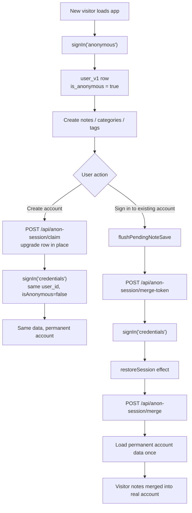

# Login, Signup & Anonymous Sessions

This document describes how authentication works in the Notes web app
(`notes-next`), how anonymous visitors get a real database-backed session without
signing in, and how their content becomes permanent when they create an account
or sign in to an existing one.

For implementation details inside the app package, see
`apps/notes-next/AGENTS.md` (especially "Anonymous → permanent account" and "Note
saving lifecycle"). For the original design history, see:

- `.cursor/plans/anonymous_account_architecture_4d7e2b10.plan.md` — Phase 1
  (merge race fix) and Phase 2 (claim-in-place signup, password hashing)
- `.cursor/plans/anonymous_merge_sync_fix_8f2c1a90.plan.md` — merge hardening
  (flush before login, merge-failure UX, embedding backfill, preferences)

## Overview

Every new visitor can use the app immediately — create notes, categories, and
tags — without registering. Behind the scenes:

1. The browser has **no session** on first load.
2. `NotesApp` detects `authStatus === "unauthenticated"` and calls
   `signIn("anonymous")`.
3. NextAuth creates a real `user_v1` row with `is_anonymous = true` and issues
   a JWT session cookie.
4. All notes API calls use that session; content lives in Postgres like any
   other user.

When the visitor later **creates an account**, the anonymous row is upgraded in
place (same `user_id`, no data movement). When they **sign in to an existing
account**, anonymous content is merged server-side into the permanent account and
the anonymous row is deleted.



## Data model

Anonymous users are not a separate storage layer. They are ordinary `user_v1`
rows:

| Column         | Anonymous visitor           | After claim (new account) | Permanent account (login target) |
| -------------- | --------------------------- | ------------------------- | -------------------------------- |
| `id`           | Stable for the visit        | **Unchanged**             | Pre-existing id                  |
| `username`     | `anon-<uuid>`               | User-chosen username      | Existing username                |
| `password`     | `NULL`                      | `scrypt$…` hashed         | Hashed (or legacy plaintext)     |
| `email`        | `NULL`                      | Optional                  | May be set                       |
| `is_anonymous` | `true`                      | `false`                   | `false`                          |
| `preferences`  | UI settings on the anon row | **Kept** (same row)       | May differ from anon             |

Owned data (`user_note_v1`, `user_taxonomy_v1`, `user_taxonomy_level_v1`,
`user_note_tag_v1`, `user_note_tag_link_v1`) references `user_id` normally.
Anonymous creation also seeds a default `important` tag and a default
Epic > Category > Group chain.

## Auth stack (NextAuth / Auth.js)

Configuration lives in `apps/notes-next/src/auth.ts` with shared pages in
`auth.config.ts`. The web app uses **JWT sessions** (no server-side session
store).

### Providers

| Provider id   | Purpose                                   |
| ------------- | ----------------------------------------- |
| `anonymous`   | Auto sign-in for new visitors             |
| `credentials` | Username / email / phone + password login |

OAuth/social login was removed as unfinished (Phase 2). The Android client uses
`POST /api/auth/token` (bearer tokens) with the same `verifyUserCredentials`
path — it does not use anonymous sessions.

### JWT / session fields

The `jwt` and `session` callbacks attach:

- `session.user.notesUserId` — the `user_v1.id` used by all Notes API routes
- `session.user.isAnonymous` — `true` for visitor sessions, `false` after claim
  or credentials login

API routes resolve the acting user from the session cookie (web) or
`Authorization: Bearer` header (Android). Client-supplied `userId` fields in
request bodies are ignored.

### Password hashing

`lib/db-notes/sql/user/password.ts` implements scrypt (`node:crypto`, no extra
dependency). Format: `scrypt$<N>$<r>$<p>$<saltB64>$<hashB64>`.

`verifyUserCredentials` uses `verifyPassword`. Legacy plaintext rows still
work; on successful login the password is rehashed in place.

## Anonymous session bootstrap

```typescript
// NotesApp.tsx — runs when authStatus is "unauthenticated"
void signIn("anonymous", { redirect: false })
```

The `anonymous` credentials provider calls `createAnonymousUser()` which:

1. Inserts `user_v1` with `username = 'anon-' + randomUUID()` and
   `is_anonymous = true`
2. Seeds the default `important` tag
3. Returns the row to NextAuth for JWT minting

The app shows "Loading…" until `restoreSession` finishes loading notes,
categories, and tags for the new user.

## Path A — Create account (claim in place)

**When:** Visitor chooses "Create account" in the header user popup.

**Why this path exists:** There is only one user row. Nothing needs to move
between users, so there is no merge token and no load-path race.

### Server

`POST /api/anon-session/claim` (`app/api/anon-session/claim/route.ts`):

- Requires an authenticated **anonymous** session (`401` otherwise)
- Body: `{ username, password, email? }`
- Calls `claimAnonymousNotesAppSession` → `claimAnonymousUser` in
  `lib/db-notes/sql/user/anonymous.ts`
- In one transaction: verify row is still anonymous, check identifier conflicts
  against non-anonymous users, set username/email/password hash,
  `is_anonymous = false`
- Responses: `200` `{ user }`, `400` validation, `409` identifier taken

Validation (service layer): non-empty username, password ≥ 8 characters,
optional email must contain `@` if present.

### Client (`handleSignup` in `NotesApp.tsx`)

1. `await flushPendingNoteSave()` — persist any debounced draft on the same row
2. `POST /api/anon-session/claim` with form fields
3. On success, `applyLoadedUser(claimData.user)` so the header shows the new
   username immediately
4. `signIn("credentials", { identifier: username, password })` — re-mints JWT
   with `isAnonymous = false` for the **same** `notesUserId`
5. `restoreSession` re-runs, finds no pending merge token, refreshes data
   (cache-first is safe because `user_id` is unchanged)

**No merge token** is captured on this path.

Edge case: if claim succeeds but `signIn` fails, the account already exists.
Show "Account created — sign in with your new username and password." Do not
roll back the claim.

## Path B — Sign in to an existing account (merge)

**When:** Visitor enters credentials for an account that already exists.

Two users genuinely exist (anonymous row + permanent row), so data must be
reconciled server-side.

### Critical invariant (Phase 1)

> **There is exactly one writer of post-login session data:** the
> `restoreSession` effect in `NotesApp.tsx`.

Login handlers must **not** load notes or run the merge themselves. They only:

1. Flush pending saves
2. Capture a merge token while still anonymous
3. Call `signIn("credentials")`

`restoreSession` performs the merge and then loads the account's data once.

### Merge token

While still anonymous, `handleLogin` calls `POST /api/anon-session/merge-token`.
The route uses `createMergeToken(anonUserId)` — an HMAC-signed payload
(`apps/notes-next/src/lib/anonymousMergeToken.ts`) with a 10-minute TTL, keyed
off `AUTH_SECRET`.

The token is stored in `sessionStorage` under `notes-pending-merge-token` so it
survives the credentials sign-in transition.

### Merge execution

When `restoreSession` runs for a **non-anonymous** session and finds a pending
token:

1. `POST /api/anon-session/merge` with `{ mergeToken }`
2. Server verifies token, calls `mergeAnonymousUserInto(anonUserId, realUserId)`

Merge SQL (simplified):

- **Taxonomy / tags:** dedupe by label on the real account, build id remap
  tables (taxonomy walks Epic > Category > Group top-down)
- **Notes:** reparent to real `user_id`, remap `group_id`
- **Tag links:** remap `tag_id` through the tag dedup map
- **Delete** anonymous `user_v1` row (CASCADE drops orphaned anon taxonomy/tags)

`MERGE_TABLE_STRATEGIES` in `anonymous.ts` documents every table with a direct
FK to `user_v1`. `db:verify` diffs this map against the live schema so new
user-owned tables cannot be forgotten silently.

### Merge failure UX

If merge returns non-OK, sign-in still succeeds. `restoreSession` shows a
recoverable warning: "Signed in, but we couldn't move your visitor notes…"
Anonymous data remains on the orphaned row for manual recovery or cleanup.

### Client login sequence (`handleLogin`)

1. `await flushPendingNoteSave()`
2. If anonymous: fetch merge token → stash in `sessionStorage`
3. `signIn("credentials", { identifier, password, redirect: false })`
4. On failure: clear stashed token, show login error
5. On success: `setSessionLoading(true)` — `restoreSession` merges + reloads

## Session restore & caching

`restoreSession` (effect in `NotesApp.tsx`) is the central loader after any auth
change:

- Waits for `authStatus !== "loading"`
- Runs pending merge (if any) **before** loading lists
- Skips stale cache paint after merge (cached snapshot predates merge)
- Otherwise uses stale-while-revalidate from `localStorage` notes cache
- Fetches `/api/session`, notes, categories, tags in parallel

Dependencies include `authSession.user.notesUserId` and
`authSession.user.isAnonymous`, so claim and login both trigger a refresh.

## API reference (auth-related)

| Route                           | Method | Caller session    | Purpose                           |
| ------------------------------- | ------ | ----------------- | --------------------------------- |
| `/api/auth/[...nextauth]`       | \*     | —                 | NextAuth sign-in/out              |
| `/api/auth/token`               | POST   | —                 | Android credentials → bearer      |
| `/api/auth/token`               | DELETE | Bearer            | Revoke token                      |
| `/api/session`                  | GET    | Any authenticated | Current user summary              |
| `/api/session`                  | PATCH  | Any authenticated | Save UI preferences               |
| `/api/anon-session/merge-token` | POST   | Anonymous         | Mint HMAC merge token             |
| `/api/anon-session/merge`       | POST   | Permanent         | Merge anon data into this account |
| `/api/anon-session/claim`       | POST   | Anonymous         | Upgrade anon row to permanent     |

## UI entry points

All auth UI for the web app lives in the header user popup
(`NotesHeader.tsx`), not a separate login page (`auth.config.ts` sets
`signIn: "/"`).

Anonymous users see a toggle between two modes (`authMode` local state):

| Mode     | Form fields                                     | Primary action |
| -------- | ----------------------------------------------- | -------------- |
| `signin` | Identifier + password                           | Sign in        |
| `signup` | Username, email (optional), password (8+ chars) | Create account |

Permanent users see account info, debug embedding actions, and Sign out.

## Shipped vs. unfinished work

### Shipped (Phase 1 + Phase 2)

- Anonymous auto sign-in on first visit
- Single post-login loader (`restoreSession`) with merge-before-load
- Claim-in-place signup with scrypt password hashing
- Existing-account merge with HMAC token
- Flush pending note save before login, signup, and logout
- Merge failure warning (non-blocking)
- Merge SQL fix for extraneous bind params on tag-link remap
- `MERGE_TABLE_STRATEGIES` schema-coverage guard in `db:verify`
- OAuth removal

### Still open (from merge sync plan)

| Item                           | Status  | Notes                                                                                                              |
| ------------------------------ | ------- | ------------------------------------------------------------------------------------------------------------------ |
| Embedding backfill after merge | Pending | Call `maintainNoteEmbeddingsForNotesApp({ mode: "missing" })` after merge so merged categories/tags are searchable |
| Preferences on merge           | Pending | Anon `preferences` are discarded when anon row is deleted; product decision needed                                 |
| Automated merge tests          | Pending | No harness coverage for anonymous → permanent flows yet                                                            |

Claim-in-place signup **does** preserve preferences automatically (same row).

---

## Known bug: "Create account" toggle fires claim prematurely

### Symptom

When an anonymous user opens the header popup and clicks the secondary **Create
account** button on the default **Sign in** form, the browser immediately sends
`POST /api/anon-session/claim` with empty `username` / `password`. The request
fails validation (`400`). Only after opening the popup again does the user see
the signup form, fill it in, and complete account creation successfully.

### Root cause

The sign-in and signup UIs are **two separate `<form>` elements** toggled by
local `authMode` state (`"signin" | "signup"`). The intended behavior of the
secondary **Create account** button on the sign-in form is **UI-only**: switch
`authMode` to `"signup"` so the user can enter credentials.

The bug is a classic HTML form issue combined with React's synchronous re-render
on click:

1. The **Create account** toggle sits **inside** the sign-in `<form>`.
2. Gravity UI `<Button>` does not set `type="button"` on mode-switch buttons
   (only the primary action sets `type="submit"` explicitly).
3. A `<button>` inside a form defaults to `type="submit"`.
4. On click, `onClick` runs `setAuthMode("signup")`. React re-renders and
   mounts the signup form in place of the sign-in form.
5. The implicit form submit still fires against the **new** signup form's
   `onSubmit`, which calls `onSignupSubmit` → `handleSignup` →
   `POST /api/anon-session/claim` with empty field state.

So the first click both switches the UI **and** submits the signup form before
the user has typed anything.

Relevant code today:

```184:192:apps/notes-next/src/components/notes/NotesHeader.tsx
                <Button
                  view="flat"
                  size="m"
                  width="max"
                  disabled={authPending}
                  onClick={() => setAuthMode("signup")}
                >
                  Create account
                </Button>
```

The signup form submit handler (correct for the primary **Create account**
button, incorrect when triggered by the toggle):

```206:214:apps/notes-next/src/components/notes/NotesHeader.tsx
              <form
                onSubmit={(event) => {
                  event.preventDefault()
                  onSignupSubmit({
                    username: signupUsername,
                    email: signupEmail,
                    password: signupPassword,
                  })
                  setMenuOpen(false)
                }}
```

### Fix plan — finish the signup UX

Goal: clicking **Create account** on the sign-in view must **only** switch to
the signup form. No network requests until the user submits the signup form with
valid input.

#### 1. Prevent implicit form submission on mode toggles (required)

Add `type="button"` to both mode-switch buttons:

- Sign-in view: **Create account** → `setAuthMode("signup")`
- Signup view: **I already have an account** → `setAuthMode("signin")`

This is the minimal, correct HTML fix. Optionally also call
`event.preventDefault()` in each toggle's `onClick` as defense in depth.

#### 2. Reset popup state on close (recommended)

When the user menu popup closes (`onClose` / `setMenuOpen(false)`):

- Reset `authMode` to `"signin"` so reopening always starts on the sign-in form
- Clear signup field state (`signupUsername`, `signupEmail`, `signupPassword`)
  and any displayed auth error

This avoids showing a half-filled signup form or stale errors on the next open.

#### 3. Client-side guard before claim (recommended)

In `handleSignup`, validate fields before `fetch("/api/anon-session/claim")`:

- Trim username; require non-empty
- Require password length ≥ 8 (match server rules)

Return early with a friendly inline error instead of hitting the API with empty
bodies. This does not replace fix (1) but prevents confusing `400` responses if
submit is triggered unexpectedly again.

#### 4. Keep popup open on auth failure (recommended)

Today both forms call `setMenuOpen(false)` on submit regardless of outcome
(sign-in form closes even when login fails, because close is in `onSubmit` before
async handler completes). For signup, only close the popup after **successful**
claim + credentials sign-in. On validation or `409` conflict, keep the popup
open on the signup form so the user can correct input or switch to sign-in.

Wire this by moving `setMenuOpen(false)` into the success paths of
`handleLogin` / `handleSignup` in `NotesApp.tsx` (or returning success/failure
from handlers to `NotesHeader`).

#### 5. Verification checklist

Manual:

1. Open anonymous session, create a note
2. Open user popup → click **Create account** (secondary, sign-in view)
3. **Expect:** signup form appears; **no** network call to `/api/anon-session/claim`
4. Fill username + password → click **Create account** (primary)
5. **Expect:** claim → credentials sign-in → same note visible, header shows new username
6. Repeat with duplicate username → `409`, popup stays open with error
7. Toggle **I already have an account** → back to sign-in, no network calls

Automated (follow-up): a component test that clicks the toggle and asserts
`handleSignup` / claim fetch is not invoked.

### Files to touch

| File                                                   | Change                                                                                                           |
| ------------------------------------------------------ | ---------------------------------------------------------------------------------------------------------------- |
| `apps/notes-next/src/components/notes/NotesHeader.tsx` | `type="button"` on toggles; popup close resets `authMode` + signup fields; defer menu close to parent on success |
| `apps/notes-next/src/components/notes/NotesApp.tsx`    | Optional client validation in `handleSignup`; close popup only on success                                        |
| `apps/notes-next/AGENTS.md`                            | Note the sign-in/signup toggle behavior once fixed                                                               |

No server or schema changes are required for this fix — it is purely client-side
form behavior.
