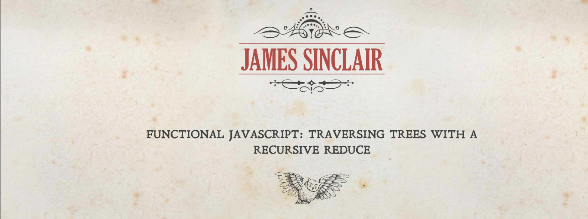

# Read

Learn Typescript:[ https://www.educative.io/path/typescript-for-front-end-developers](https://www.educative.io/path/typescript-for-front-end-developers)

This guy writes a great blog about JavaScript:

[https://jrsinclair.com/articles/2019/functional-**js-traversing-trees**-with-recursive-reduce/](https://jrsinclair.com/articles/2019/functional-js-traversing-trees-with-recursive-reduce/)  
[https://jrsinclair.com/articles/2019/magical-mystical-**js-transducers**/](https://jrsinclair.com/articles/2019/magical-mystical-js-transducers/)  
[https://jrsinclair.com/articles/2019/**algebraic-structures**-what-i-wish-someone-had-explained-about-functional-programming/](https://jrsinclair.com/articles/2019/algebraic-structures-what-i-wish-someone-had-explained-about-functional-programming/)

Video: ["Data Driven UIs, Incrementally" by Yaron Minsky](https://www.youtube.com/watch?v=R3xX37RGJKE&feature=emb_logo)

