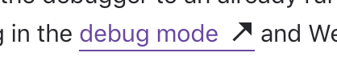

# Icons



```text
.link--external::after {
    display: inline;
    margin-left: 6px;
    content: '\00a0\00a0\00a0\00a0';
    color: transparent;
    background: url(data:image/svg+xml,%3Csvg xmlns='http://www.w3.org/2000/svg' width='16' height='16' fill='%2327282c'%3E%3Cpath d='M14 2H5.75l3.595 3.595L2.22 12.72l1.06 1.06 7.125-7.125L14 10.25V2z' fill='%2327282c' /%3E%3C/svg%3E) no-repeat 50%/100%;
    line-height: inherit;
}
```


